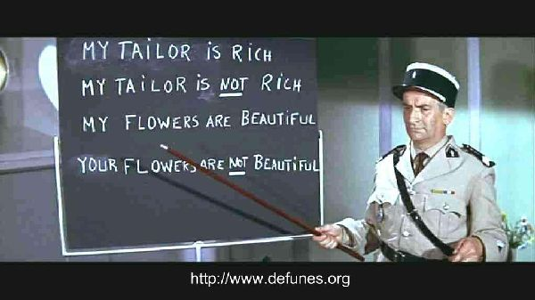

<!-- author: "Vincent VIVANLOC" -->

<!-- date: "January 2022" -->

<!-- README.md is generated from readme.Rmd. Please edit that file -->

<!-- command: radian then rmarkdown::render("readme.Rmd", encoding = "UTF-8","all") -->

# Hackaviz 2022: private copying levy (also known as blank media tax or levy) in France.

Not speaking english? La [version française](README.md) ici.

---

, CC-BY-SA
Nina Paley, mars 2011](images/ME_338_YouMayBeRight2.png)

We offer you a new dataset from the [AidesCreation.org](http://aidescreation.org/consultation-aides_culturelles_versees_base_actions_soutenues-1.html) site. This site provides a database about the collection and distribution of [private copying levy](https://en.wikipedia.org/wiki/Private_copying_levy) fundings done by several [copyright collecting societies or collective management organizations](https://en.wikipedia.org/wiki/Copyright_collective).

This dataset is spread over three files. It is possible to make beautiful visualizations from just one of these files. You can also combine them, but the most beautiful story might not need all this data.

This year, no geographical data, but data in text form. This is an opportunity to discover the vast field of lexical analysis or to sharpen your best algorithms.

Find the rules and evaluation methods on the [Hackaviz rules page](https://toulouse--dataviz-fr.translate.goog/hackaviz/reglement/?_x_tr_sl=auto&_x_tr_tl=en&_x_tr_hl=fr&_x_tr_pto=wapp) of the [Toulouse DataViz (TDV) association](https://toulouse--dataviz-fr.translate.goog/association/?_x_tr_sl=auto&_x_tr_tl=en&_x_tr_hl=fr&_x_tr_pto=wapp).

Do not hesitate to contact us on the Toulouse DataViz [discord](https://discord.com/invite/RbTR4jKRp9) to discuss between participants, if you need help with the data, or to report errors in the dataset.

Good luck!

# Dataset overview

Each dataset is available as two files, one as a form of tabular data in the format
[`.csv`](https://fr.wikipedia.org/wiki/Comma-separated_values) for
your favorite data processing tool, and the other in open format
[`.xlsx`](https://fr.wikipedia.org/wiki/XLSX) for Microsoft Excel,
LibreOffice or your favorite spreadsheet.

To download a data file, place the mouse over the name of the
file, right click and choose “Save link target
under …".

## CSV files

| Data file                                                                                                                               | Content                                                   |
| --------------------------------------------------------------------------------------------------------------------------------------- | --------------------------------------------------------- |
| [`actions-culturelles-soutenues.csv`](https://github.com/ToulouseDataViz/Hackaviz2022/raw/main/data/actions-culturelles-soutenues.csv) | cultural actions supported by the private copying levy    |
| [`aggregation_par_organisme.csv`](https://github.com/ToulouseDataViz/Hackaviz2022/raw/main/data/agregation_par_organisme.csv)             | summary by collecting organization and by type of support |
| [`collecteurs.csv`](https://github.com/ToulouseDataViz/Hackaviz2022/raw/main/data/collecteurs.csv)                                      | description of collecting organizations                   |

An archive (`.zip`) is also available for
[downloading](https://github.com/ToulouseDataViz/Hackaviz2022/raw/main/data/data.zip)
all data.

- Files are encoded in UTF-8.
- `csv` files use the column separator “`,`” and the
  decimal character “`.`”.
- These `csv` were exported from an english locale.
  Remember to change the import settings of your favorite software!
- If you have difficulty importing these `csv`, we
  offer an alternative in the form of a file in Microsoft Excel format.

## XLSX files

| Data file                                                                                                                                | Content                                                   |
| ---------------------------------------------------------------------------------------------------------------------------------------- | --------------------------------------------------------- |
| [`actions-culturelles-soutenues.xlsx`](https://github.com/ToulouseDataViz/Hackaviz2022/raw/main/data/actions-culturelles-soutenues.xlsx) | cultural actions supported by the private copying levy    |
| [`agregation_par_organisme.xlsx`](https://github.com/ToulouseDataViz/Hackaviz2022/raw/main/data/agregation_par_organisme.xlsx)           | summary by collecting organization and by type of support |
| [`collecteurs.xlsx`](https://github.com/ToulouseDataViz/Hackaviz2022/raw/main/data/collecteurs.xlsx)                                     | description of collecting organizations                   |

## Joins

- We have taken care to unify the name of the `collecteur` column
  files so you can make
  [joins](https://en.wikipedia.org/wiki/Join_(SQL)).
- You have no obligation to merge these files: remember
  the story you want to tell is an important facet of a good dataviz!
- To join two `csv` you can use template
  [ObservableHQ](https://ressources.toulouse-dataviz.fr/newsletter--toulouse-dataviz-15--spcial-hackaviz-2021),
  libraries like [python Pandas](https://pandas.pydata.org/) or
  [Rdplyr](https://dplyr.tidyverse.org/reference/mutate-joins.html)
  or code it directly.

## Format of values

- Amounts have been rounded to the nearest euro.
- The dates are years in YYYY format.

# Dataset detailed description

## Description of the `supported-cultural-actions.csv` file

Cultural actions supported by private copying levy

- This file contains the description of beneficiaries (authors,
  production company or any other member of the organization
  collector), the cultural project and the associated amount.

- Definitions

  - **Collecting organization**: company through which authors
    can manage the copyright associated with their work. By
    centralizing this management, these companies facilitate the collection and payment of royalties.
  - **Work**: a work of art is an artistic or
    aesthetic creation.
  - **Copyright**: type of intellectual property that gives its owner the exclusive right to copy and distribute a creative work, usually for a limited time.
  - **Beneficiary**: author of the work of art or his successors as publisher, production company or heirs
  - **Private copying**: exception to copyright, which allows
    individuals to copy works for their private use. A
    part of the price of a blank media (recording medium or device) serves to remunerate the authors.

- Notes on the dataset

  - The beneficiary projects are collected from the year 2016 to 2021.
  - The names of the beneficiaries have been consolidated as best as possible (example:
    the variations `1d Zik`,`1D Zik`,`1D ZIK`,`1D ZIK production`,`1D ZIK prod` are grouped under the name `1d Zik`)
    but it is possible that some unconsolidated values ​​remain.
  - In the same way, the description of the projects has been consolidated.
  - Descriptions that are too long may be truncated.
  - Hackaviz rules state that you are prohibited from
    use data source other than that provided: you can
    find out about a singer or production company
    for your storytelling but you cannot include either its
    bibliography, nor his discography in your dataviz.

This description is available as a `.csv` file
[meta_actions-culturelles-soutenues.csv](https://github.com/ToulouseDataViz/Hackaviz2022/raw/main/meta/meta_actions-culturelles-soutenues.csv).

| column name  | description                                    | type_value       | example                                                                           |
| :----------- | :--------------------------------------------- | :--------------- | :-------------------------------------------------------------------------------- |
| collecteur   | collecting agency code as an acronym           | character string | SACEM                                                                             |
| annee        | year of project receiving copyright collection | integer          | 2017                                                                              |
| aide         | type of support                                | character string | diffusion du spectacle vivant                                                     |
| beneficiaire | beneficiary name                               | character string | 03:50                                                                             |
| projet       | project description                            | character string | Tournées et showcases hors France - musiques actuelles et jazz - Marianne Dissard |
| montant      | amount received in euros                       | integer          | 1500                                                                              |
| oeuvre       | type of artwork supported                      | character string | Concert                                                                           |

## Description of the `aggregation_par_organisme.csv` file

Summary by collecting organizations and by type of support, year by year

- This file contains one line for each collecting organization and
  for each type of support.
- The columns are, for each year, the number of beneficiaries and
  the total amount paid.

This description is available as a `.csv` file
[meta_aggregation_par_organisme.csv](https://github.com/ToulouseDataViz/Hackaviz2022/raw/main/meta/meta_agregation_par_organisme.csv).

| column name                    | description                                      | type_value       | example                       |
| :----------------------------- | :----------------------------------------------- | :--------------- | :---------------------------- |
| collecteur                     | collecting organism acronym                      | character string | SACEM                         |
| type_daide                     | type of support                                  | character string | live performance distribution |
| nb_aides_2016                  | number of fundings issued for the year 2016      | integer          | 160                           |
| montant_2016                   | total amount in euros of funding granted in 2016 | integer          | 1725108                       |
| nb_aides_2017, montant_2017, … | ditto for the following years                    |                  | 223                           |

## Description of the `collectors.csv` file

Description of collecting organizations

- This file contains the description of the collecting organizations.
- The members of an organization are the artists covered by this
  organization. They are listed in alphabetical order and are separated by a comma.

This description is available as a `.csv` file
[meta_collecteurs.csv](https://github.com/ToulouseDataViz/Hackaviz2022/raw/main/meta/meta_collecteurs.csv).

| column           | description                                              | type_value       | example                                                                               |
| :--------------- | :------------------------------------------------------- | :--------------- | :------------------------------------------------------------------------------------ |
| collecteur       | collecting agency code as an acronym                     | character string | SACEM                                                                                 |
| libelle          | organization full name                                   | character string | Society of Authors, Composers and Publishers of Music                                 |
| œuvre            | type of work of art covered by the organization          | character string | Music                                                                                 |
| date_creation    | year of creation of the organization                     | integer          | 1851                                                                                  |
| membres          | artists or producers who are members of the organization | character string | arranger, author, author of dubbing under titling, authors director, composer, editor |
| nb_membres       | number of members                                        | integer          | 182520                                                                                |
| nb_membres_annee | year when this number of members was increased           | integer          | 2021                                                                                  |
| URL              | website address                                          | character string | <https://www.sacem.fr/>                                                               |

# Data sources

- Data from the site
  [AidesCreation.org](http://aidescreation.org/consultation-aides_culturelles_versees_base_actions_souttenues-1.html).
- This site is published by the association [“La Culture avec la Copie
  private”](https://www.copieprivee.org) which aims to promote
  remuneration by private copying. The publishing director
  is none other than the president of one of the collecting organizations
  (SOFIA). Finally, this association has for members, the 17 organizations
  collectors that feed the database.

# Version history

- December 2021: consolidation of files and generation of readme and
  export under R and Visual Studio Code

# Terms of Service

- This dataset is offered by the Toulouse DataViz association
  as part of the Hackaviz contest to promote the
  data visualization. This dataset is to be used for
  teaching material purpose by allowing participants to create their own visualizations.

- The source data come from official organizations which
  publish on the Internet without a known license. These data, listed
  in the previous section, have been processed by the Toulouse DataViz association, the dataset may has been cleaned and completed. The Toulouse DataViz association cannot guarantee
  the accuracy, completeness and timeliness of the datasets
  sources or the processing carried out on this dataset.

- The visualizations produced at the end of this competition during a time limited does not engage the responsibility of the Toulouse DataViz association.

- The dataset is for the exclusive use of Hackaviz. For all
  other uses, please contact the Toulouse DataViz association.
